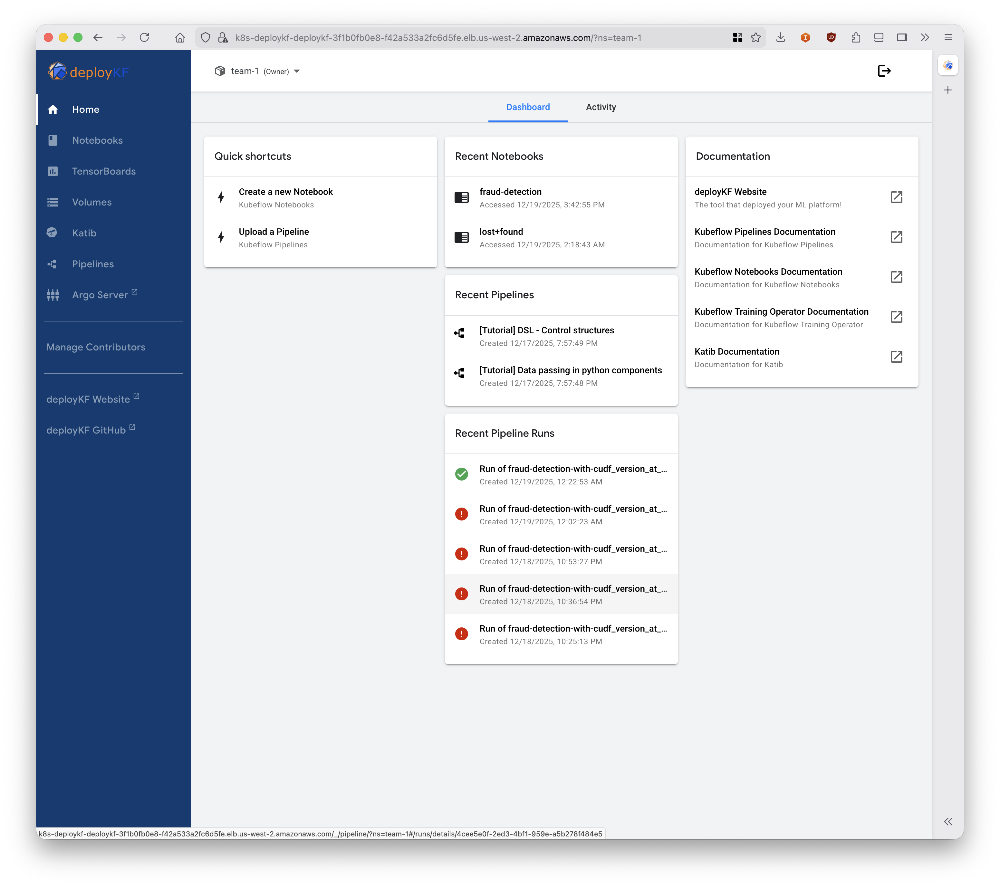
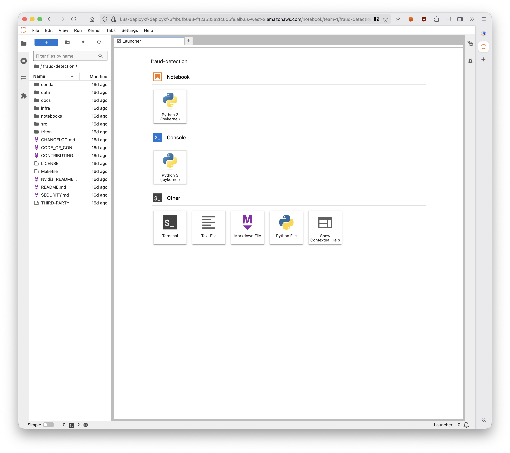
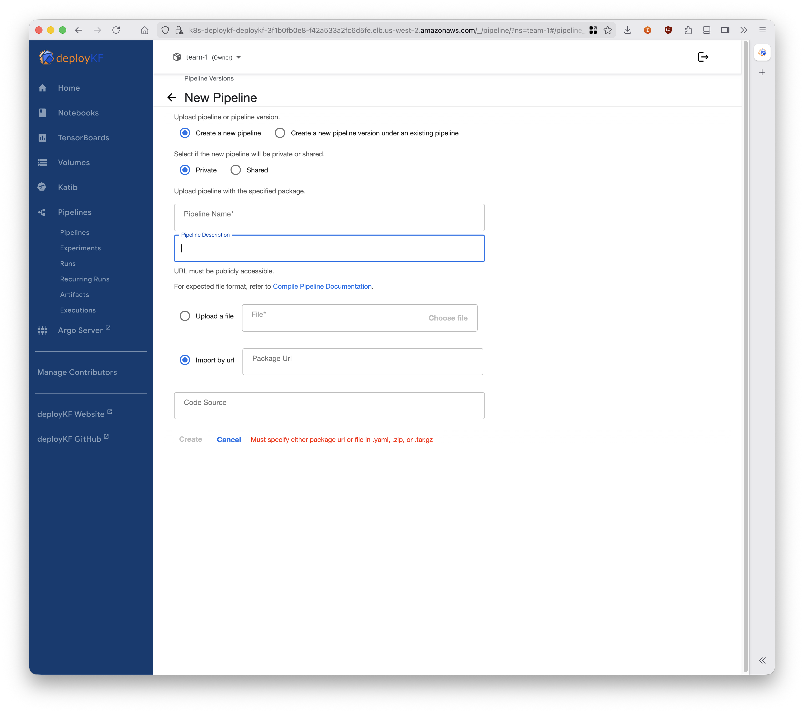
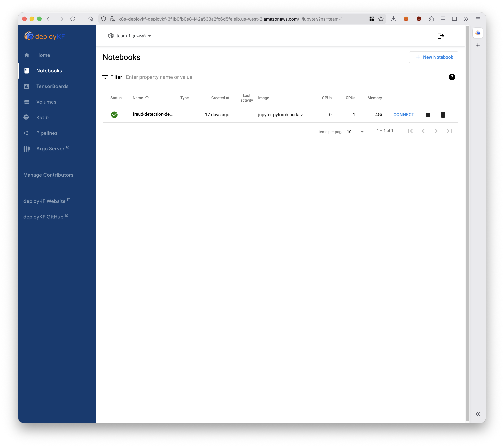

# GNN based financial fraud detection on AWS with Nvidia

Financial fraud costs institutions billions annually, and traditional rule-based systems struggle to keep pace with increasingly sophisticated attack patterns. This blueprint demonstrates a different approach: using Graph Neural Networks to analyze the relationships between transactions, merchants, and cardholders as a connected graph rather than isolated events.

The insight is simple. Fraudsters don't operate in isolation. They create patterns across multiple accounts, merchants, and time windows that become visible when you model transactions as a graph. A single suspicious transaction might look normal. That same transaction connected to a web of related activity tells a different story.


This implementation runs entirely on AWS using Kubeflow Pipelines for orchestration, RAPIDS for GPU-accelerated preprocessing, and NVIDIA Triton for inference. The infrastructure deploys via CDK, and ArgoCD handles the GitOps workflow for model updates.

## The Pipeline

When you trigger a pipeline run, five things happen in sequence.

**Download** pulls the TabFormer dataset from S3. This is IBM's synthetic credit card transaction dataset containing 24 million transactions across 5,000 cardholders and 1,000 merchants. It's synthetic but statistically representative of real fraud patterns.

**Preprocess** transforms raw transactions into graph structure. Each cardholder becomes a node, each merchant becomes a node, and transactions become edges connecting them. This stage runs on GPU using RAPIDS/cuDF because doing this transformation on 24 million rows with pandas would take hours. With cuDF it takes minutes.

**Train** runs the actual model. The architecture combines a Graph Neural Network (specifically GraphSAGE) that learns embeddings from the transaction graph with XGBoost that makes the final fraud/not-fraud prediction. The GNN captures structural patterns. XGBoost captures tabular feature patterns. Together they outperform either alone.

**Upload** packages the trained model in Triton's expected format and pushes it to S3. The model repository includes the GNN weights, XGBoost model, and a Python backend that computes Shapley values for explainability.

**Serve** happens automatically. Triton polls the S3 model repository and loads new model versions as they appear. Within minutes of training completion, the new model serves inference requests.

## Getting Started

You'll need an AWS account with permissions for EKS, EC2, ECR, and S3. Locally you'll need Docker, Node.js 20+, AWS CLI, and kubectl. The full deployment takes about 30 minutes.

```bash
cd infra
npm install

# First time only
npx cdk bootstrap aws://<ACCOUNT>/<REGION>

# Set your environment
export CDK_DEFAULT_ACCOUNT=<your-account>
export CDK_DEFAULT_REGION=<your-region>

# Deploy everything
npx cdk deploy --all
```

This creates an EKS cluster with Karpenter-managed GPU node pools, installs Kubeflow via deployKF, configures ArgoCD, and sets up the S3 buckets and ECR repositories.

Once deployment completes, update your kubeconfig and check that everything came up:

```bash
aws eks update-kubeconfig --region <region> --name nvidia-fraud-detection-cluster-blueprint
kubectl get pods -n kubeflow
```

Get the Kubeflow dashboard URL from the load balancer:

```bash
kubectl get svc -n deploykf-istio-gateway deploykf-gateway -o jsonpath='{.status.loadBalancer.ingress[0].hostname}'
```

Open the URL in your browser. The default credentials are `user@example.com` / `user`.



The dashboard gives you access to pipelines, experiments, runs, and notebook servers. The left sidebar navigates between these. Most of your time will be spent in Pipelines and Notebooks.

## Running Your First Pipeline

The easiest path is the interactive notebook. A notebook server called `fraud-detection-demo` is automatically provisioned in the `team-1` namespace when the infrastructure deploys. Navigate to Notebooks in the sidebar to access it.



The notebook workspace comes pre-loaded with this repository, so you can immediately open `fraud-detection/notebooks/kubeflow-fraud-detection.ipynb`. The notebook is self-contained: it defines all pipeline components inline, submits runs to the Kubeflow API, and includes cells for monitoring progress and testing inference.

Run through the notebook section by section:

**Section 1** installs dependencies and auto-detects your AWS account and region. If detection fails, fill in the values manually.

**Section 2** connects to the Kubeflow Pipelines API. Since you're running inside a Kubeflow notebook server, this happens automatically without authentication.

**Section 3** defines the five pipeline components. Each component is a Python function decorated with `@dsl.component` or `@dsl.container_component`. Read through these to understand what each stage does.

**Section 4** wires the components together into a pipeline with proper dependencies and resource requests. The GPU stages request `nvidia.com/gpu` accelerators and use node selectors to land on GPU nodes.

**Section 5** submits the pipeline and gives you a run ID. Click the link to watch progress in the Kubeflow UI, or use the monitoring cell to poll status from the notebook.

**Section 6** tests inference against Triton once training completes. It queries the model health endpoint and lists loaded models.

If you prefer working with compiled pipelines, you can upload YAML directly:



```bash
cd workflows
pip install kfp==2.10.1 kfp-kubernetes==1.4.0
python -m workflows.cudf_e2e_pipeline
```

This generates `fraud_detection_cudf_pipeline.yaml`. Upload it through the Pipelines UI, then create a run with your desired parameters.

## Understanding the Workflow



The `workflows/` directory contains the pipeline definition and components:

```
workflows/
├── src/workflows/
│   ├── cudf_e2e_pipeline.py      # Pipeline definition
│   └── components/
│       └── preprocess_tabformer.py   # Preprocessing logic
└── fraud_detection_cudf_pipeline.yaml  # Compiled output
```

The pipeline uses PVC-based artifact passing. Rather than uploading intermediate files to S3 between steps, components mount a shared persistent volume. This matters because the preprocessed data is several gigabytes, and round-tripping through S3 adds significant latency.

```
┌──────────┐   ┌──────────────┐   ┌────────┐   ┌────────────────┐
│ Download │ → │ cuDF Preproc │ → │ Config │ → │ GNN+XGB Train  │
│ from S3  │   │ (GPU)        │   │ Writer │   │ (GPU)          │
└──────────┘   └──────────────┘   └────────┘   └────────────────┘
      │                │                │               │
      └────────────────┴────────────────┴───────────────┘
                              │
                    ┌─────────────────┐
                    │  Shared PVC     │
                    │  (100Gi gp3)    │
                    └─────────────────┘
                              │
                      ┌───────────────┐
                      │ Upload to S3  │
                      └───────────────┘
                              │
                              ▼
   s3://ml-on-containers-<account>-model-registry/model-repository/
                              │
                              ▼
                    ┌───────────────┐
                    │ Triton Server │
                    │ (auto-loads)  │
                    └───────────────┘
```

The training container outputs a Triton model repository structure. The upload component pushes this to `s3://ml-on-containers-<account>-model-registry/model-repository/`. Triton's `--model-repository` flag points to this S3 path, and it periodically checks for new models.

The model itself is called `prediction_and_shapley`. It takes merchant features, user features, and graph edge information as inputs. It returns fraud probability plus Shapley values that explain which features contributed most to the prediction. This explainability matters for regulatory compliance and fraud analyst workflows.

## What's Next

The default hyperparameters work reasonably well, but you can tune them through pipeline parameters:

- `gnn_num_epochs`: More epochs generally improve accuracy but increase training time
- `xgb_num_boost_round`: XGBoost boosting rounds, higher values risk overfitting
- `gnn_hidden_channels`: Width of the GNN layers, larger captures more patterns

To use your own data, replace the S3 source path and ensure your CSV has the expected columns. The preprocessing script expects TabFormer's schema, so you may need to modify `workflows/src/workflows/components/preprocess_tabformer.py` for different datasets.

## Cleanup

```bash
cd infra
npx cdk destroy --all
```

This removes the EKS cluster, node groups, and associated resources. S3 buckets with data may need manual deletion if they're not empty.

## Contributing

See [CONTRIBUTING](CONTRIBUTING.md) for our contribution guide.

## Security

See [CONTRIBUTING](CONTRIBUTING.md##security-issue-notifications) for reporting security issues.

## License

MIT-0 License. See [LICENSE](LICENSE).

## Authors

- Shardul Vaidya, AWS Partner Solutions Architect
- Zachary Jacobson, AWS Partner Solutions Architect
- Ragib Ahsan, AWS AI Acceleration Architect
